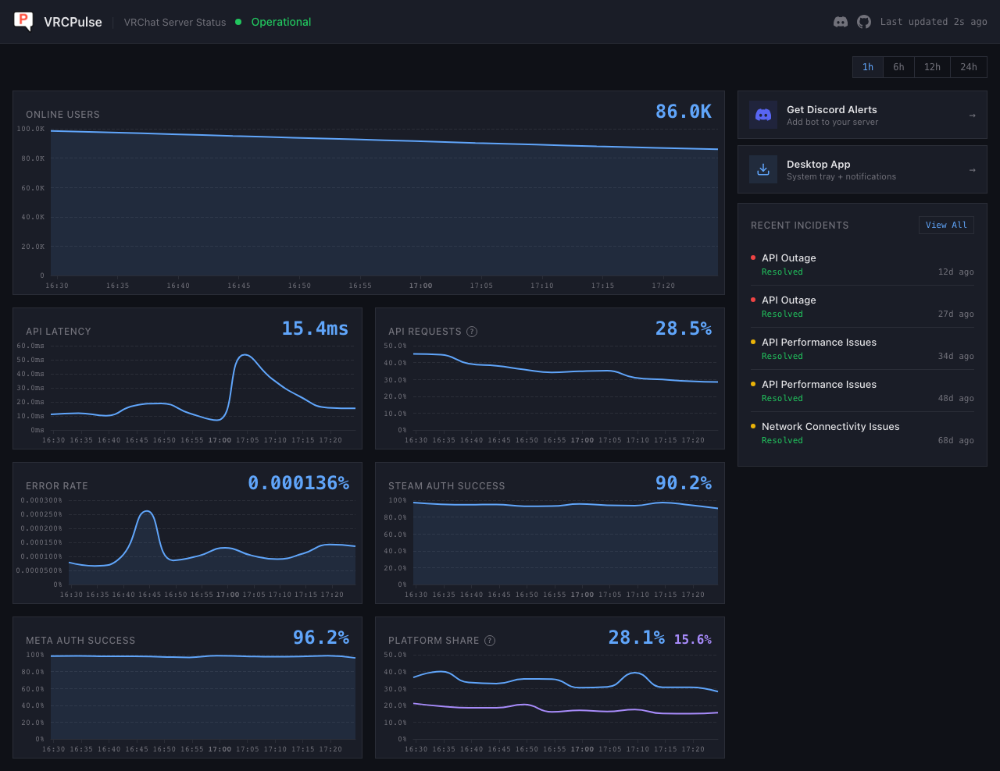
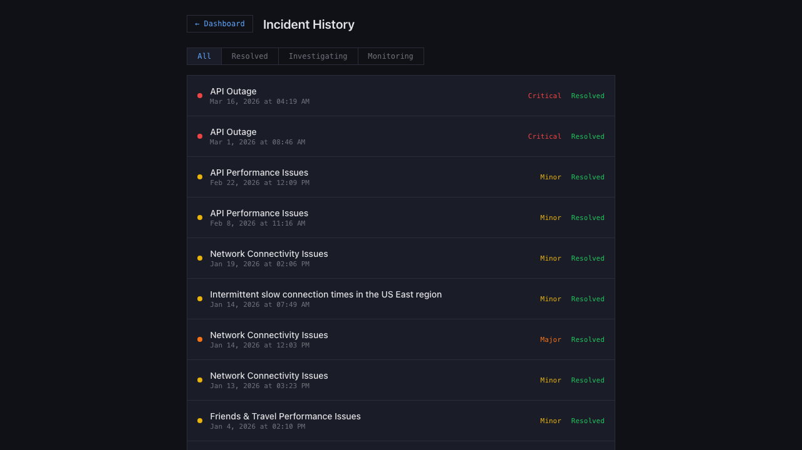

<div align="center">


# VRCPulse

**Real Time VRChat Server Outage Detector**

[](https://www.rust-lang.org/)
[](https://tauri.app/)
[](https://svelte.dev/)
[](https://discord.com/oauth2/authorize?client_id=1456912795462275166&permissions=49152&scope=bot%20applications.commands)
[](LICENSE)

Monitor VRChat server status, API latency, error rates, and incident history with live-updating charts. Available as a **desktop app**, **web dashboard**, and **Discord bot**.

[Web Dashboard](https://vrcpulse.vrcdevs.com) · [Download Desktop App](https://github.com/Hebububu/VRCPulse/releases/latest) · [Add Discord Bot](https://discord.com/oauth2/authorize?client_id=1456912795462275166&permissions=49152&scope=bot%20applications.commands) · [Discord Community](https://discord.gg/JW3XrskcpK)

</div>

## Dashboard

<div align="center">

</div>

## Features

### Desktop App (Tauri v2)
- Native app for **macOS**, **Windows**, and **Linux**
- System tray with color-coded status indicator
- Native OS notifications on VRChat status changes
- Auto-updater with one-click update

### Web Dashboard
- Live-updating dashboard at your own domain
- 7 interactive charts: Online Users, API Latency, API Requests, Error Rate, Steam Auth, Meta Auth, Platform Share
- Time range selector (1h / 6h / 12h / 24h)
- Incident history with full timeline and change tracking

### Discord Bot
- `/status` command with visualized dashboard charts
- `/report` command for user incident reporting
- `/config` command for alert channel setup
- Threshold-based alerts when reports spike
- Multi-language support (English / Korean)

## Architecture

```
VRChat Status API
       │
       ▼
vrcpulse-core (collector + service layer)
       │
       ├── vrcpulse-bot (Discord)
       ├── vrcpulse-server (Axum + Web)
       └── desktop (Tauri v2 + Svelte)
```

4-crate Cargo workspace sharing a common core library.

## Tech Stack

| Layer | Technology |
|-------|-----------|
| Core | Rust, Tokio, SeaORM, SQLite |
| Desktop | Tauri v2, Svelte 5, TypeScript |
| Charts | Apache ECharts |
| Web Server | Axum, tower-http |
| Discord | Serenity |
| CI/CD | GitHub Actions |
| Deploy | Docker, EC2 |

## Quick Start

### Use the Web Dashboard
Visit [vrcdevs.com](https://vrcdevs.com)

### Download Desktop App
[Latest Release](https://github.com/Hebububu/VRCPulse/releases/latest) - macOS (.dmg), Windows (.exe), Linux (.deb, .rpm, .AppImage)

> **macOS**: After installing, run `xattr -cr /Applications/VRCPulse.app` in Terminal to bypass Gatekeeper (unsigned app).

### Add Discord Bot
[Add to Discord](https://discord.com/oauth2/authorize?client_id=1456912795462275166&permissions=49152&scope=bot%20applications.commands)

### Self-Host

```bash
git clone https://github.com/Hebububu/VRCPulse.git
cd VRCPulse

# Web server
cp .env.example .env
cargo run -p vrcpulse-server

# Desktop app
cd desktop && cargo tauri dev

# Discord bot
cargo run -p vrcpulse-bot
```

### Docker (Web Server)

```bash
docker build -f Dockerfile.web -t vrcpulse-web .
docker run -d -p 80:80 -v vrcpulse-data:/data vrcpulse-web
```

## Incident History

<div align="center">

</div>

Browse full VRChat incident history with status timeline, update tracking, and direct links to status.vrchat.com.

## Discord Bot Demo

<div align="center">

</div>

## Community

- [Discord Server](https://discord.gg/JW3XrskcpK)
- [GitHub Issues](https://github.com/Hebububu/VRCPulse/issues)

## License

MIT License.
