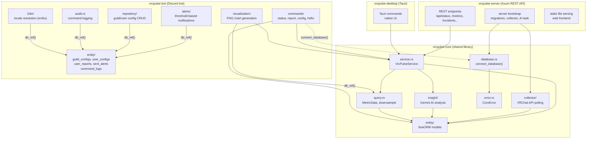
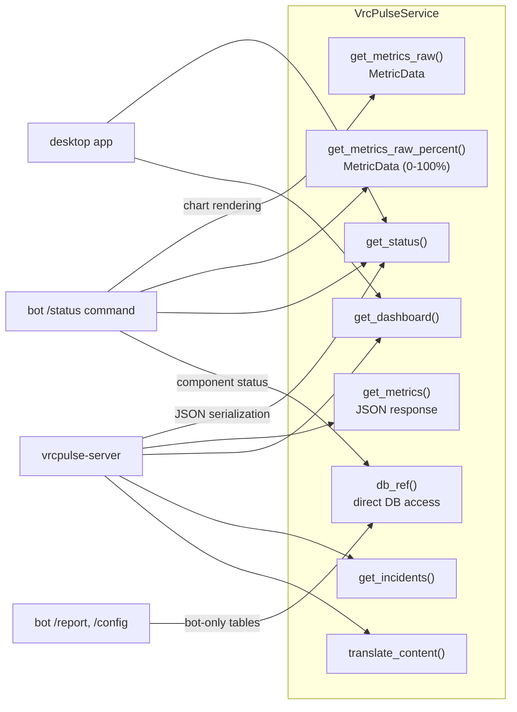
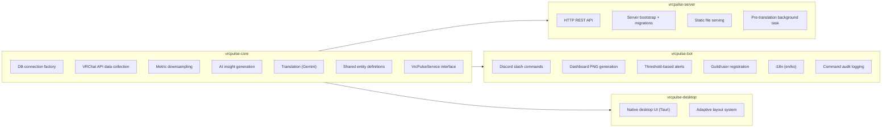
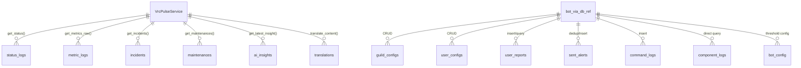

# VRCPulse Crate Architecture

## Crate Dependencies

```mermaid
graph TD
    subgraph core["vrcpulse-core (shared library)"]
        DB["database.rs<br/>connect_database()"]
        SVC["service.rs<br/>VrcPulseService"]
        COL["collector/<br/>VRChat API polling"]
        QRY["query.rs<br/>MetricData, downsample"]
        ENT["entity/<br/>SeaORM models"]
        INS["insight/<br/>Gemini AI analysis"]
        ERR["error.rs<br/>CoreError"]

        SVC --> QRY
        SVC --> ENT
        SVC --> INS
        COL --> ENT
        INS --> ENT
        QRY --> ENT
        DB --> ERR
    end

    subgraph server["vrcpulse-server (Axum REST API)"]
        ROUTES["REST endpoints<br/>/api/status, /metrics, /incidents..."]
        BOOT_S["server bootstrap<br/>migrations, collector, AI task"]
        STATIC["static file serving<br/>web frontend"]
    end

    subgraph bot["vrcpulse-bot (Discord bot)"]
        CMD["commands/<br/>status, report, config, hello"]
        VIZ["visualization/<br/>PNG chart generation"]
        ALERT["alerts/<br/>threshold-based notifications"]
        REPO["repository/<br/>guild/user config CRUD"]
        I18N["i18n/<br/>locale resolution (en/ko)"]
        BOT_ENT["entity/<br/>guild_configs, user_configs<br/>user_reports, sent_alerts<br/>command_logs"]
        AUDIT["audit.rs<br/>command logging"]
    end

    subgraph desktop["vrcpulse-desktop (Tauri)"]
        TAURI["Tauri commands<br/>native UI"]
    end

    %% core dependencies
    ROUTES --> SVC
    BOOT_S --> DB
    BOOT_S --> COL

    CMD --> SVC
    VIZ --> SVC
    CMD -->|"db_ref()"| ENT
    ALERT -->|"db_ref()"| BOT_ENT
    REPO -->|"db_ref()"| BOT_ENT
    AUDIT -->|"db_ref()"| BOT_ENT
    I18N -->|"db_ref()"| BOT_ENT
    VIZ --> QRY

    CMD -.->|"connect_database()"| DB
    TAURI --> SVC
```

## Data Access Patterns

```mermaid
flowchart LR
    subgraph service["VrcPulseService"]
        direction TB
        GS["get_status()"]
        GM["get_metrics()<br/>JSON response"]
        GMR["get_metrics_raw()<br/>MetricData"]
        GMP["get_metrics_raw_percent()<br/>MetricData (0-100%)"]
        GD["get_dashboard()"]
        GI["get_incidents()"]
        GT["translate_content()"]
        DBREF["db_ref()<br/>direct DB access"]
    end

    SERVER["vrcpulse-server"] -->|"JSON serialization"| GS
    SERVER --> GM
    SERVER --> GD
    SERVER --> GI
    SERVER --> GT

    BOT_DASH["bot /status command"] -->|"chart rendering"| GMR
    BOT_DASH --> GMP
    BOT_DASH --> GS
    BOT_DASH -->|"component status"| DBREF

    BOT_CMD["bot /report, /config"] -->|"bot-only tables"| DBREF

    DESKTOP["desktop app"] --> GS
    DESKTOP --> GD
```

## Crate Responsibilities

```mermaid
graph LR
    subgraph core_resp["vrcpulse-core"]
        direction TB
        C1["DB connection factory"]
        C2["VRChat API data collection"]
        C3["Metric downsampling"]
        C4["AI insight generation"]
        C5["Translation (Gemini)"]
        C6["Shared entity definitions"]
        C7["VrcPulseService interface"]
    end

    subgraph server_resp["vrcpulse-server"]
        direction TB
        S1["HTTP REST API"]
        S2["Server bootstrap + migrations"]
        S3["Static file serving"]
        S4["Pre-translation background task"]
    end

    subgraph bot_resp["vrcpulse-bot"]
        direction TB
        B1["Discord slash commands"]
        B2["Dashboard PNG generation"]
        B3["Threshold-based alerts"]
        B4["Guild/user registration"]
        B5["i18n (en/ko)"]
        B6["Command audit logging"]
    end

    subgraph desktop_resp["vrcpulse-desktop"]
        direction TB
        D1["Native desktop UI (Tauri)"]
        D2["Adaptive layout system"]
    end

    core_resp --> server_resp
    core_resp --> bot_resp
    core_resp --> desktop_resp
```

## Bot-specific vs Shared Tables

```mermaid
erDiagram
    VrcPulseService ||--o{ status_logs : "get_status()"
    VrcPulseService ||--o{ metric_logs : "get_metrics_raw()"
    VrcPulseService ||--o{ incidents : "get_incidents()"
    VrcPulseService ||--o{ maintenances : "get_maintenances()"
    VrcPulseService ||--o{ ai_insights : "get_latest_insight()"
    VrcPulseService ||--o{ translations : "translate_content()"

    bot_via_db_ref ||--o{ guild_configs : "CRUD"
    bot_via_db_ref ||--o{ user_configs : "CRUD"
    bot_via_db_ref ||--o{ user_reports : "insert/query"
    bot_via_db_ref ||--o{ sent_alerts : "dedup/insert"
    bot_via_db_ref ||--o{ command_logs : "insert"
    bot_via_db_ref ||--o{ component_logs : "direct query"
    bot_via_db_ref ||--o{ bot_config : "threshold config"
```
