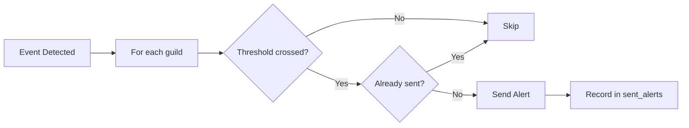

# Alert Documentation Guide

Guidelines for writing and maintaining alert policy documentation.

## Purpose

This document defines principles for maintaining consistency in alert documentation including trigger conditions, thresholds, deduplication, and notification formats.

---

## Document Structure

### File Naming Convention

```
docs/alerts/
├── AGENTS.md                       # This guide
├── README.md                       # Alert system overview
├── policy-user-threshold.md        # User report threshold alerts [NOT IMPLEMENTED]
├── policy-vrchat-status.md         # VRChat status change alerts [NOT IMPLEMENTED]
└── policy-cloudfront.md            # CloudFront metrics alerts [NOT IMPLEMENTED]
```

**Naming Rules:**
- **Use kebab-case**: `policy-user-threshold.md` [o]
- **Prefix with policy-**: All alert policy docs start with `policy-`
- **Be descriptive**: Name should indicate the alert trigger
- **Avoid generic names**: No `alert.md` or `notification.md`

### Document Layout

```markdown
# {Alert Policy Name}

Brief description of what triggers this alert.

---

## Overview

When this alert fires and why it matters.

---

## Trigger Conditions

### Condition 1
- **Threshold**: value
- **Time window**: duration
- **Check**: `file:line` reference

---

## Deduplication

How duplicate alerts are prevented.

- **Strategy**: description
- **Reference ID format**: `{type}_{window}`
- **Implementation**: `file:line`

---

## Alert Message

### Embed Format

```
[Title] Alert Title
[Description] Alert description
[Color] Color (hex)
[Fields]
  Field 1: Value
  Field 2: Value
[Footer] Footer text
```

---

## Implementation

### Source Files [PLANNED]

> **Note**: Alert modules do not exist yet. Use this format when implemented:

| Component | File | Lines |
|-----------|------|-------|
| Trigger check | `src/alerts/xxx.rs` | (TBD) |
| Message format | `src/alerts/xxx.rs` | (TBD) |

---

## Configuration

| Setting | Default | Description |
|---------|---------|-------------|
| `threshold` | 5 | Number of reports to trigger |

---

## Related Documents

- Links to related docs
```

---

## Required Sections

### 1. Trigger Conditions

Document exactly when an alert fires:

```markdown
## Trigger Conditions

### User Report Threshold

Alert fires when:
- Report count >= `guild_configs.threshold` (default: 5)
- Within time window of `guild_configs.report_interval` (default: 60 minutes)
- Per incident type (login, api, etc.)

**Query logic**: `src/alerts/threshold.rs` [PLANNED]

```sql
-- Pseudocode (actual implementation TBD)
SELECT COUNT(*) FROM user_reports
WHERE guild_id = ?
  AND incident_type = ?
  AND created_at > NOW() - INTERVAL '? minutes'
```
```

### 2. Deduplication Strategy

Document how duplicate alerts are prevented:

```markdown
## Deduplication

### Strategy
Per incident_type + hourly time window

### Reference ID Format
```
{incident_type}_{hour_window}
```

**Examples:**
- `login_2026-01-05T12:00`
- `api_2026-01-05T13:00`

### Implementation [PLANNED]
- **ID generation**: `src/alerts/threshold.rs` (TBD)
- **Dedup check**: `src/alerts/threshold.rs` (TBD)

### Behavior
- Same incident_type can only alert once per hour per guild
- Different incident_types alert independently
- New hour = new alert window
```

### 3. Alert Message Format

Document the exact embed structure:

```markdown
## Alert Message

### Embed Format

```
[Title] High Report Volume Detected
[Description] **5** users reported **Login Issues** in the last 60 minutes
[Color] Orange (0xf0b132)
[Fields]
  Incident Type: Login Issues (inline)
  Report Count: 5 (inline)
  Time Window: 60 minutes (inline)
  Recent Reports: (not inline)
    - @User1 - 2 min ago: "Can't login"
    - @User2 - 5 min ago
    - @User3 - 8 min ago
[Footer] Check /status for official VRChat status
[Timestamp] Current time
```

### Implementation [PLANNED]
- **Embed builder**: `src/alerts/notifications.rs` (TBD)
- **Field formatting**: `src/alerts/notifications.rs` (TBD)
```

### 4. Configuration Table

```markdown
## Configuration

### Guild Settings (`guild_configs` table)

| Column | Default | Range | Description |
|--------|---------|-------|-------------|
| `threshold` | 5 | 1-100 | Reports needed to trigger |
| `report_interval` | 60 | 5-1440 | Time window (minutes) |
| `channel_id` | null | N/A | Alert destination channel |
| `enabled` | true | N/A | Enable/disable alerts |

### Source References
- **Entity**: `src/entity/guild_configs.rs:8-17`
- **Defaults**: `migration/src/m20260103_001_create_table.rs:17-19`
```

### 5. Error Handling

```markdown
## Error Handling

| Scenario | Behavior |
|----------|----------|
| No channel configured | Skip alert, log warning |
| Channel not accessible | Skip alert, log error |
| Database error | Log error, continue to next guild |
| Discord API error | Log error, don't record as sent |

### Implementation [PLANNED]
- **Error handling**: `src/alerts/mod.rs` (TBD)
```

---

## Writing Principles

### 1. Reference, Don't Duplicate

**Docs should reference code locations, not copy code.**

**Do This:**
```markdown
### Threshold Check
- **Count query**: `src/alerts/threshold.rs` (line TBD when implemented)
- **Comparison**: `src/alerts/threshold.rs` (line TBD when implemented)
```

**Don't Do This:**
```markdown
### Threshold Check
```rust
let count = user_reports::Entity::find()
    .filter(...)
    // 20 lines of code
```
```

### 2. Document the Contract, Not Implementation

For alert messages, document the format users see:

```markdown
## Alert Message

### Fields Displayed
| Field | Value | Source |
|-------|-------|--------|
| Title | "High Report Volume Detected" | hardcoded |
| Report Count | dynamic | `user_reports` count |
| Time Window | from config | `guild_configs.report_interval` |
```

### 3. No Emojis

Use text markers for status:

```markdown
## Implementation Status

| Alert Type | Status |
|------------|--------|
| User threshold | [ ] Not implemented |
| VRChat status | [ ] Not implemented |
| CloudFront metrics | [ ] Not implemented |
```

**Exception**: Discord alert message examples may include emojis when they represent actual bot output (e.g., status indicators in embed fields).

### 4. Include Mermaid Diagrams

For complex alert flows:

````markdown
## Alert Flow


````

---

## Validation Checklist

Check after writing/modifying alert documentation:

### Accuracy
- [ ] Trigger conditions match implementation
- [ ] Threshold values match code defaults
- [ ] Deduplication logic matches code
- [ ] Message format matches actual output

### Completeness
- [ ] All trigger conditions documented
- [ ] Deduplication strategy explained
- [ ] Alert message format shown
- [ ] Configuration options listed
- [ ] Error handling documented

### Consistency
- [ ] File names use `policy-` prefix
- [ ] Same section structure across docs
- [ ] No emojis (use [x], [ ], [o])
- [ ] Tables use consistent formatting

### Maintenance
- [ ] Update when alert logic changes
- [ ] Verify line numbers after code changes
- [ ] Test message format matches docs

---

## Source Files to Verify Against

| Documentation Topic | Verify Against | Status |
|--------------------|----------------|--------|
| Alert service | `src/alerts/mod.rs` | [PLANNED] |
| Threshold logic | `src/alerts/threshold.rs` | [PLANNED] |
| Notifications | `src/alerts/notifications.rs` | [PLANNED] |
| Deduplication | `src/entity/sent_alerts.rs` | Exists |
| Guild config | `src/entity/guild_configs.rs` | Exists |
| User reports | `src/entity/user_reports.rs` | Exists |

---

## Common Mistakes and Prevention

| Mistake | Prevention |
|---------|------------|
| Wrong threshold default | Check migration file |
| Wrong time window | Check guild_configs entity |
| Missing dedup explanation | Always document reference_id format |
| Copying alert code | Use `file:line` references |
| Using emojis | Use `[x]`, `[ ]`, text markers |

---

## Anti-Patterns

### NEVER
- Copy alert building code into docs
- Use emojis in documentation
- Document planned alerts as implemented
- Skip deduplication documentation

### ALWAYS
- Reference code with `file:line` format
- Document exact message format
- Explain deduplication strategy
- Include configuration defaults

---

## Related Documents

- `docs/AGENTS.md` - Documentation index
- `docs/commands/AGENTS.md` - Command documentation guide
- `docs/system/AGENTS.md` - System documentation guide
- `docs/commands/report.md` - /report command (triggers user threshold)
- `AGENTS.md` (root) - Project-wide conventions
