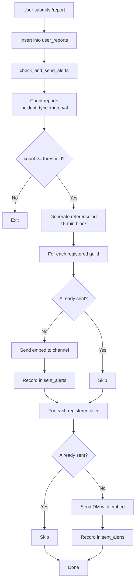

# User Report Threshold Alert

Alert triggered when multiple users report the same incident type within a time window.

---

## Status

> **[IMPLEMENTED]**: Completed Jan 7, 2026

---

## Overview

This alert monitors user-submitted reports via `/report` command. When the number of reports for a specific incident type exceeds the configured threshold within a time window, alerts are sent to all registered guilds and users.

**Key Design Decisions:**
- Global threshold (all reports combined, not per-guild)
- Alerts sent to all registered recipients (guilds + users)
- Report data is anonymized (no user attribution in alerts)

---

## Trigger Conditions

### Threshold Check

Alert fires when:
- Report count >= `bot_config.report_threshold` (default: 5, set to 1 for testing)
- Within time window: `bot_config.report_interval` minutes (default: 60)
- Per incident type (login, instance, api, auth, download, other)
- Status = "active" (reports can be resolved later)

### Incident Types

| Value | Display Name |
|-------|--------------|
| `login` | Login Issues |
| `instance` | Instance/World Loading |
| `api` | API/Website Issues |
| `auth` | Authentication Issues |
| `download` | Content Download Issues |
| `other` | Other Issues |

---

## Deduplication

### Strategy
Per incident_type + 15-minute time window + recipient

### Reference ID Format
```
threshold_{incident_type}_{date}T{hour}:{minute_block}
```

**Examples:**
- `threshold_login_2026-01-07T12:15`
- `threshold_api_2026-01-07T13:30`

### Behavior
- Same incident_type can only alert once per 15-minute block per recipient
- Different incident_types alert independently
- Guild and user alerts tracked separately
- New 15-minute block = new alert window

---

## Alert Message

### Embed Format

```
[Title] High Report Volume Detected
[Description] **{count}** users reported **{incident_type}** in the last {window} minutes.
[Color] Orange (0xf0b132)
[Fields]
  Recent Reports: (not inline)
    - Just now
    - 2 min ago
    - 5 min ago
    (up to 5 entries, anonymized)
[Footer] Check /status for official VRChat status
[Timestamp] Current time
```

---

## Configuration

### Global Settings (`bot_config` table)

| Key | Default | Description |
|-----|---------|-------------|
| `report_threshold` | 5 (1 for testing) | Reports needed to trigger |
| `report_interval` | 60 | Time window (minutes) |

**Note**: These are global settings, not per-guild. Change in database to adjust.

**Source**: `migration/src/m20260103_001_create_table.rs` (seed data)

### Constants

| Constant | Value | Description |
|----------|-------|-------------|
| `MAX_RECENT_REPORTS` | 5 | Timestamps shown in alert |
| `COLOR_ALERT` | 0xf0b132 | Orange/warning color |
| Dedup window | 15 min | Hardcoded in reference_id generation |

> **Note**: Threshold and interval values come from `bot_config` table (seeded in migration). If missing, code logs warning and uses defaults (threshold=5, interval=60).

---

## Implementation

### Source Files

| Component | File |
|-----------|------|
| Public API (`check_and_send_alerts`) | `src/alerts/threshold.rs` |
| Database queries (config, reports, guilds, users) | `src/alerts/threshold.rs` |
| Alert sending (guild channel, user DM) | `src/alerts/threshold.rs` |
| Helpers (reference_id, embed builder) | `src/alerts/threshold.rs` |

### Entry Point

```rust
pub async fn check_and_send_alerts(ctx: &Context, db: &DatabaseConnection, incident_type: &str)
```

Called from `/report` command after inserting a new report.

**Integration point**: `src/commands/report.rs` (after report insert)

### Database Tables

| Table | Purpose |
|-------|---------|
| `user_reports` | Source of report data |
| `bot_config` | Threshold and interval settings |
| `guild_configs` | Registered guilds (channel_id) |
| `user_configs` | Registered users (for DM alerts) |
| `sent_alerts` | Deduplication tracking |

---

## Flow Diagram



---

## Related Documents

- `docs/commands/report.md` - /report command (creates user reports)
- `docs/commands/config.md` - /config command (registers guilds/users)
- `docs/system/database-schema.md` - Table definitions
- `docs/alerts/AGENTS.md` - Alert documentation guide
