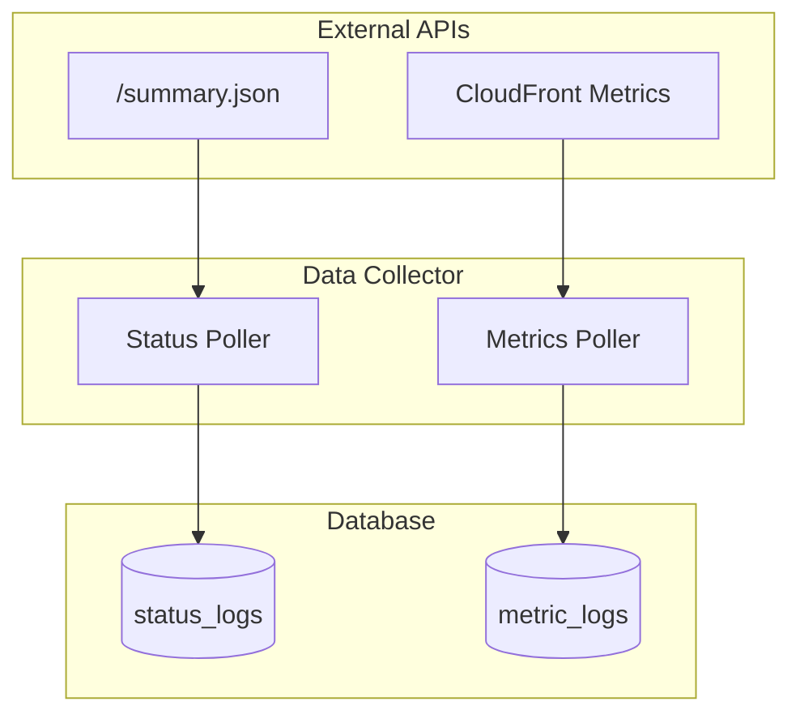
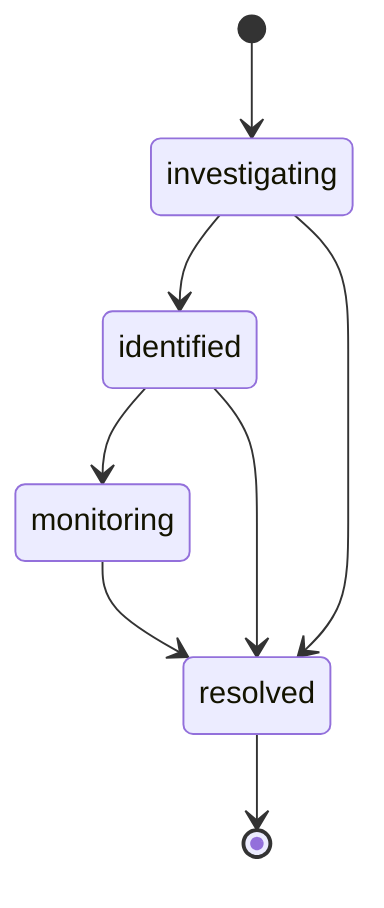

# System Documentation Guide

Guidelines for writing and maintaining system architecture documentation.

## Purpose

This document defines principles for maintaining consistency in system documentation including data collectors, database schema, visualization engine, and background services.

---

## Document Structure

### File Naming Convention

```
docs/system/
├── AGENTS.md                    # This guide
├── data-collector.md            # Data collection service design
├── database-schema.md           # Complete database schema
└── visualization-engine.md      # Chart generation system
```

**Naming Rules:**
- **Use kebab-case**: `data-collector.md` [o]
- **System-first naming**: Start with the system/component name
- **Be descriptive**: Name should indicate the architectural component
- **Avoid generic names**: No `system.md` or `service.md`
- **Remove completed plans**: Delete `*-plan.md` files once implemented

### Document Layout

```markdown
# {System/Component Name}

Brief description of the system's purpose.

---

## Overview

(Architecture diagram using mermaid)

---

## Source Files

| Component | File | Lines |
|-----------|------|-------|
| Main module | `src/xxx/mod.rs` | 1-50 |
| Service logic | `src/xxx/service.rs` | 10-120 |

---

## Key Concepts

### Concept 1
Description with file references.
- **Implementation**: `src/xxx.rs:45-67`

### Concept 2
...

---

## Data Flow / State Machine

(Mermaid diagrams for flow or state transitions)

---

## Configuration

| Setting | Default | Description |
|---------|---------|-------------|
| `setting_name` | value | What it controls |

---

## Error Handling

| Error | Handling |
|-------|----------|
| Network timeout | Log warning, retry next interval |

---

## Related Documents

- Links to related docs
```

---

## Required Sections

### 1. Overview with Architecture Diagram

Include mermaid diagrams for system relationships:

````markdown
## Overview


````

### 2. Source Files Table

**Reference code locations, don't copy code:**

```markdown
## Source Files

| Component | File | Lines |
|-----------|------|-------|
| Module entry | `src/collector/mod.rs` | 1-80 |
| Status polling | `src/collector/status.rs` | 12-71 |
| Incident polling | `src/collector/incident.rs` | 14-130 |
| HTTP client | `src/collector/client.rs` | 1-85 |
| API models | `src/collector/models.rs` | 1-120 |
```

### 3. Key Concepts with References

```markdown
## Key Concepts

### Deduplication Strategy

Prevent duplicate records using source timestamps.

- **Status logs**: `src/collector/status.rs:19-24`
- **Component logs**: `src/collector/status.rs:45-49`
- **Metric logs**: `src/collector/metrics.rs:34-42`

### Dynamic Polling Intervals

Polling intervals are configurable via database and watch channels.

- **Config module**: `src/collector/config.rs:161-199`
- **Poll loop**: `src/collector/mod.rs:39-73`
```

### 4. State Machine / Flow Diagrams

For systems with state transitions:

````markdown
## State Machine

### Incident States



### State Definitions
- **Enum**: `src/entity/incidents.rs:13` (status field)

### Valid Transitions
| From | To | Trigger | Code Reference |
|------|-----|---------|----------------|
| investigating | identified | API update | `src/collector/incident.rs:76-81` |
| * | resolved | Missing from API | `src/collector/incident.rs:36-46` |
````

### 5. Configuration Section

```markdown
## Configuration

### Environment Variables

| Variable | Required | Default | Description |
|----------|----------|---------|-------------|
| `DATABASE_URL` | Yes | N/A | SQLite connection string |
| `RUST_LOG` | No | `info` | Log level |

### Database Configuration

| Key | Default | Range | Description |
|-----|---------|-------|-------------|
| `polling.status` | 60 | 60-3600 | Status poll interval (seconds) |
| `polling.metrics` | 60 | 60-3600 | Metrics poll interval (seconds) |

- **Config loading**: `src/collector/config.rs:162-199`
```

### 6. Error Handling Table

```markdown
## Error Handling

| Scenario | Action | Code Reference |
|----------|--------|----------------|
| Network timeout | Log error, skip cycle | `src/collector/mod.rs:57-59` |
| Invalid JSON | Log error, skip cycle | `src/collector/mod.rs:57-59` |
| DB write failure | Log error, skip cycle | `src/collector/mod.rs:57-59` |
| API rate limit | [NOT IMPLEMENTED] | N/A |
```

---

## Writing Principles

### 1. Reference, Don't Duplicate

**Docs should reference code locations, not copy code.**

**Do This:**
```markdown
### Polling Loop
- **Dynamic interval**: `src/collector/mod.rs:39-73`
- **Interval update**: `src/collector/mod.rs:62-70`
```

**Don't Do This:**
```markdown
### Polling Loop
```rust
async fn poll_loop_dynamic<F, Fut>(
    name: &'static str,
    // ... 30 lines of code
}
```
```

### 2. Keep Diagrams Updated

- Mermaid diagrams must match actual implementation
- Verify against source files after changes
- Use consistent styling across documents

### 3. No Emojis

Use text markers for status:

```markdown
## Implementation Status

| Component | Status |
|-----------|--------|
| Status polling | [x] Complete |
| Incident polling | [x] Complete |
| Alert service | [ ] Not started |
```

**Exception**: Discord response examples may include emojis when they represent actual bot output (e.g., status indicators in embed fields).

### 4. Document Anti-Patterns

Reference the root AGENTS.md for project-wide anti-patterns:

```markdown
## Anti-Patterns

See [root AGENTS.md](../../AGENTS.md) for project-wide anti-patterns.

**System-specific rules:**
- Never skip deduplication checks
- Never modify DB on API failure
- Never use `unwrap()` in polling loops
```

---

## Validation Checklist

Check after writing/modifying system documentation:

### Accuracy
- [ ] All `file:line` references are accurate
- [ ] Mermaid diagrams match actual implementation
- [ ] Configuration values match code defaults
- [ ] Error handling matches actual behavior

### Completeness
- [ ] Source files table with line numbers
- [ ] Architecture diagram included
- [ ] All states/transitions documented
- [ ] Related documents section

### Consistency
- [ ] File names use kebab-case
- [ ] Same section structure across docs
- [ ] No emojis (use [x], [ ], [o])
- [ ] Tables use consistent formatting

### Maintenance
- [ ] Remove plan docs after implementation
- [ ] Update line numbers after code changes
- [ ] Verify diagrams render correctly

---

## Source Files to Verify Against

| Documentation Topic | Verify Against |
|--------------------|----------------|
| Data collector | `src/collector/*.rs` [PLANNED] |
| Database schema | `migration/src/*.rs`, `src/entity/*.rs` [PLANNED] |
| Visualization | `src/visualization/*.rs` [PLANNED] |
| Configuration | `src/config.rs`, `src/collector/config.rs` |
| Error types | `src/error.rs`, `src/collector/client.rs` |

---

## Common Mistakes and Prevention

| Mistake | Prevention |
|---------|------------|
| Copying code blocks | Use `file:line` references |
| Outdated diagrams | Verify against source after changes |
| Wrong default values | Check actual code/migration |
| Missing state transitions | Review all match arms in code |
| Using emojis | Use `[x]`, `[ ]`, `[STATUS]` |

---

## Anti-Patterns

### NEVER
- Copy implementation code into docs
- Use emojis for status markers
- Leave planning docs after implementation complete
- Document features that don't exist

### ALWAYS
- Reference code with `file:line` format
- Include architecture diagrams
- Document all error handling
- Update diagrams when code changes

---

## Related Documents

- `docs/AGENTS.md` - Documentation index
- `docs/commands/AGENTS.md` - Command documentation guide
- `docs/alerts/AGENTS.md` - Alert documentation guide
- `AGENTS.md` (root) - Project-wide conventions
