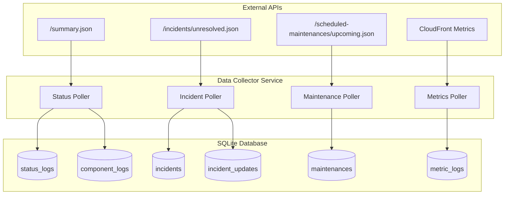
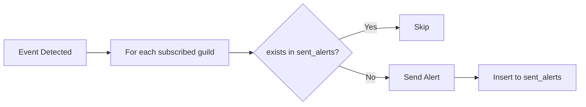

# Data Collector

This document describes the data collection strategy for **VRCPulse**. The collector periodically fetches data from external APIs and stores it in the local SQLite database.

---

## Overview

---

## Source Files

| Component | File | Lines |
|-----------|------|-------|
| Module entry | `src/collector/mod.rs` | 1-79 |
| HTTP client | `src/collector/client.rs` | 1-37 |
| Status polling | `src/collector/status.rs` | 1-71 |
| Incident polling | `src/collector/incident.rs` | 1-130 |
| Maintenance polling | `src/collector/maintenance.rs` | 1-118 |
| Metrics polling | `src/collector/metrics.rs` | 1-102 |
| API models | `src/collector/models.rs` | 1-143 |
| Dynamic config | `src/collector/config.rs` | 1-270 |

---

## Data Sources

### 1. VRChat Status API (Atlassian Statuspage)

**Base URL**: `https://status.vrchat.com/api/v2`

| Endpoint | Purpose | Target Table |
| :--- | :--- | :--- |
| `/summary.json` | Primary polling source (aggregated data) | `status_logs`, `component_logs` |
| `/incidents/unresolved.json` | Active incidents for immediate alerts | `incidents`, `incident_updates` |
| `/scheduled-maintenances/upcoming.json` | Upcoming maintenance info | `maintenances` |
| `/scheduled-maintenances/active.json` | In-progress maintenance detection | `maintenances` |

**API URL helpers**: `src/collector/client.rs:29-37`

### 2. CloudFront Metrics API (Unofficial)

**Base URL**: `https://d31qqo63tn8lj0.cloudfront.net`

| Endpoint | Metric Name | Unit |
| :--- | :--- | :--- |
| `/apilatency.json` | `api_latency` | ms |
| `/visits.json` | `visits` | count |
| `/apirequests.json` | `api_requests` | count |
| `/apierrors.json` | `api_errors` | count |
| `/extauth_steam.json` | `extauth_steam` | ms |
| `/extauth_oculus.json` | `extauth_oculus` | ms |
| `/extauth_steam_count.json` | `extauth_steam_count` | count |
| `/extauth_oculus_count.json` | `extauth_oculus_count` | count |

**Metrics definitions**: `src/collector/models.rs:101-143`

---

## Polling Strategy

### Intervals

| Data Type | Default Interval | Configurable |
| :--- | :--- | :--- |
| Status & Components | 60 seconds | Yes, via `/admin config` |
| Active Incidents | 60 seconds | Yes, via `/admin config` |
| Scheduled Maintenances | 60 seconds | Yes, via `/admin config` |
| CloudFront Metrics | 60 seconds | Yes, via `/admin config` |

> **Note**: All pollers default to 60 seconds as seeded in the database migration. See `migration/src/m20260103_001_create_table.rs:244-252`.

**Dynamic interval implementation**: `src/collector/mod.rs:39-73`

### Deduplication & Upsert Strategy

| Table | Unique Key | Strategy | Implementation |
| :--- | :--- | :--- | :--- |
| `status_logs` | `source_timestamp` | Skip if exists | `src/collector/status.rs:19-24` |
| `component_logs` | `(component_id, source_timestamp)` | Skip if exists | `src/collector/status.rs:45-49` |
| `incidents` | `id` (PK) | Upsert | `src/collector/incident.rs:61-103` |
| `incident_updates` | `id` (PK) | Skip if exists | `src/collector/incident.rs:105-130` |
| `maintenances` | `id` (PK) | Upsert | `src/collector/maintenance.rs:79-112` |
| `metric_logs` | `(metric_name, timestamp)` | Skip if exists | `src/collector/metrics.rs:45-65` |

---

## Key Behaviors

### Incident Resolution Detection

`/incidents/unresolved.json` removes items when resolved. Detection logic:

1. Fetch API (abort on failure - do NOT modify DB)
2. Query DB for incidents where `status != 'resolved'`
3. IDs missing from API response -> mark as `resolved`
4. Upsert remaining incidents

**Implementation**: `src/collector/incident.rs:14-59`

**Safety Guards**:
- API failure: Do not modify existing states
- Empty response: Valid (no active incidents)

### Maintenance State Transitions

| Transition | Detection |
| :--- | :--- |
| `scheduled` -> `in_progress` | Appears in `/active.json` |
| `in_progress` -> `completed` | Disappears from `/active.json` AND `NOW() > scheduled_until` |
| `scheduled` -> `completed` | `NOW() > scheduled_until` (skipped) |

**Implementation**: `src/collector/maintenance.rs:14-77`
**Update check**: `src/collector/maintenance.rs:114-118`

---

## Dynamic Configuration

Polling intervals are stored in `bot_config` table and loaded via watch channels.

| Key | Default |
|-----|---------|
| `polling.status` | 60 |
| `polling.incident` | 60 |
| `polling.maintenance` | 60 |
| `polling.metrics` | 60 |

**Config initialization**: `src/collector/config.rs:162-199`
**Interval update**: `src/collector/config.rs:110-132`

---

## Error Handling

| Scenario | Action | Location |
| :--- | :--- | :--- |
| HTTP error | Log error, skip cycle | `src/collector/mod.rs:57-59` |
| DB write failure | Log error, skip cycle | `src/collector/mod.rs:57-59` |

> **Note**: The HTTP client (`src/collector/client.rs:22-27`) uses `error_for_status()` which converts HTTP errors (4xx/5xx) to Reqwest errors. No custom retry or backoff logic is currently implemented.

---

## Alert Integration

When the collector detects changes, it may trigger alerts. The `sent_alerts` table prevents duplicate notifications per guild.

### Alert Events

| Event | Trigger | `alert_type` | `reference_id` |
| :--- | :--- | :--- | :--- |
| Status Change | `indicator` changes | `status` | `{indicator}_{source_timestamp}` |
| New Incident | New ID inserted | `incident` | `{incident_id}` |
| Incident Update | New update inserted | `incident_update` | `{update_id}` |
| Incident Resolved | Status -> `resolved` | `incident_resolved` | `{incident_id}` |
| Maintenance Scheduled | New maintenance | `maintenance` | `{maintenance_id}` |
| Maintenance Started | Status -> `in_progress` | `maintenance_started` | `{maintenance_id}` |
| Maintenance Completed | Status -> `completed` | `maintenance_completed` | `{maintenance_id}` |

> **Note**: Alert service is [NOT IMPLEMENTED] yet. See `docs/alerts/` for planned logic.

### Deduplication Flow

---

## Data Retention

| Table | Retention | Status |
| :--- | :--- | :--- |
| `status_logs` | 180 days | [PLANNED] |
| `component_logs` | 180 days | [PLANNED] |
| `incidents` | Indefinite | N/A |
| `incident_updates` | Indefinite | N/A |
| `maintenances` | 90 days | [PLANNED] |
| `metric_logs` | 90 days | [PLANNED] |
| `sent_alerts` | 30 days | [PLANNED] |

> **Note**: Cleanup tasks are not yet implemented.

---

## Related Documents

- `docs/system/database-schema.md` - Table definitions
- `docs/alerts/AGENTS.md` - Alert documentation guide
- `docs/commands/admin/config.md` - Polling interval configuration
