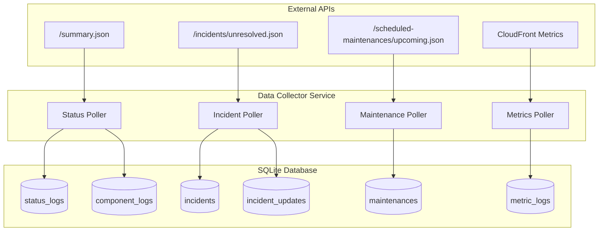
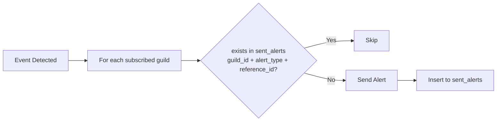

# Data Collector

This document describes the data collection strategy for **VRCPulse**. The collector periodically fetches data from external APIs and stores it in the local SQLite database.

---

## Overview



---

## Data Sources

### 1. VRChat Status API (Atlassian Statuspage)

**Base URL**: `https://status.vrchat.com/api/v2`

| Endpoint | Purpose | Target Table |
| :--- | :--- | :--- |
| `/summary.json` | Primary polling source (aggregated data) | `status_logs`, `component_logs` |
| `/incidents/unresolved.json` | Active incidents for immediate alerts | `incidents`, `incident_updates` |
| `/scheduled-maintenances/upcoming.json` | Upcoming maintenance info | `maintenances` |
| `/scheduled-maintenances/active.json` | In-progress maintenance detection | `maintenances` |

#### Response Structure: `/summary.json`

```json
{
  "page": { "updated_at": "2026-01-03T12:00:00Z" },
  "status": {
    "indicator": "none",           // none | minor | major | critical
    "description": "All Systems Operational"
  },
  "components": [
    {
      "id": "abc123",
      "name": "API / Website",
      "status": "operational"      // operational | degraded_performance | partial_outage | major_outage
    }
  ],
  "incidents": [...],
  "scheduled_maintenances": [...]
}
```

#### Response Structure: `/incidents/unresolved.json`

```json
{
  "incidents": [
    {
      "id": "abc123",
      "name": "API Issues",
      "status": "investigating",   // investigating | identified | monitoring | resolved
      "impact": "minor",
      "created_at": "2026-01-03T12:00:00Z",
      "updated_at": "2026-01-03T12:30:00Z",
      "incident_updates": [
        {
          "id": "upd001",
          "status": "investigating",
          "body": "We are investigating...",
          "created_at": "2026-01-03T12:00:00Z"
        }
      ]
    }
  ]
}
```

#### Response Structure: `/scheduled-maintenances/upcoming.json`

```json
{
  "scheduled_maintenances": [
    {
      "id": "mnt789",
      "name": "Scheduled Database Maintenance",
      "status": "scheduled",       // scheduled | in_progress | completed
      "scheduled_for": "2026-01-05T06:00:00Z",
      "scheduled_until": "2026-01-05T08:00:00Z",
      "created_at": "2026-01-03T10:00:00Z",
      "updated_at": "2026-01-03T10:00:00Z"
    }
  ]
}
```

**Field Mapping:**

| API Field | DB Column | Notes |
| :--- | :--- | :--- |
| `id` | `id` (PK) | Unique identifier |
| `name` | `title` | Maintenance title |
| `status` | `status` | State transition tracking target |
| `scheduled_for` | `scheduled_for` | Start time, change detection target |
| `scheduled_until` | `scheduled_until` | End time, change detection target |
| `created_at` | `created_at` | **Store API value as-is** (do not overwrite with local time) |
| `updated_at` | `updated_at` | **Store API value as-is** (do not overwrite with local time) |

> **Note**: Both `created_at` and `updated_at` must preserve the original API timestamps. Do not use ORM auto-timestamp features that would overwrite these with local server time.

### 2. CloudFront Metrics API (Unofficial)

**Base URL**: `https://d31qqo63tn8lj0.cloudfront.net`

| Endpoint | Description | Unit |
| :--- | :--- | :--- |
| `/apilatency.json` | API response time | ms |
| `/visits.json` | Concurrent users / traffic | count |
| `/apirequests.json` | Total API request volume | count |
| `/apierrors.json` | API error count | count |
| `/extauth_steam.json` | Steam auth latency | ms |
| `/extauth_oculus.json` | Oculus auth latency | ms |

#### Response Structure

```json
[
  [1704268800, 45.2],   // [unix_timestamp, value]
  [1704268860, 42.8],
  ...
]
```

---

## Polling Strategy

### Intervals

| Data Type | Interval | Rationale |
| :--- | :--- | :--- |
| Status & Components | **1 min** | Balance between freshness and rate limits |
| Active Incidents | **30 sec** | Quick alert response for outages |
| Scheduled Maintenances | **5 min** | Rarely changes |
| CloudFront Metrics | **1 min** | Matches data resolution |

### Deduplication & Upsert Strategy

| Table | Unique Key | Strategy |
| :--- | :--- | :--- |
| `status_logs` | `source_timestamp` | Skip if exists |
| `component_logs` | `(component_id, source_timestamp)` | Skip if exists |
| `incidents` | `id` (PK) | Upsert (see below) |
| `incident_updates` | `id` (PK) | Skip if exists (updates are immutable) |
| `maintenances` | `id` (PK) | Upsert (see below) |
| `metric_logs` | `(metric_name, timestamp)` | Skip if exists |

#### Incidents Resolution Detection

`/incidents/unresolved.json` completely removes items when an incident is resolved. To detect resolution, the following policy applies:

**Rules:**
- On each poll, query the DB for incidents where `status != 'resolved'`
- IDs **not present in API response** are considered resolved: update `status = 'resolved'`, `resolved_at = NOW()`
- IDs present in API response follow normal upsert logic

**Safety Guards:**
- **API failure**: If the API call fails (network error, non-2xx status), do **not** modify existing incident states
- **Empty response validation**: Only proceed with resolution detection if the API call was successful. An empty `incidents` array from a successful call is valid (no active incidents)
- **Retry confirmation**: Optionally, require 2 consecutive successful polls with the incident missing before marking as resolved (reduces false positives from transient API issues)

```rust
// Pseudocode
async fn poll_incidents(state: &AppState) -> Result<(), Error> {
    // 1. Fetch API - abort on failure
    let response = match fetch_unresolved_incidents().await {
        Ok(r) => r,
        Err(e) => {
            warn!("API fetch failed, skipping resolution detection: {}", e);
            return Err(e);  // Do NOT modify DB on failure
        }
    };

    let api_ids: HashSet<_> = response.incidents.iter().map(|i| &i.id).collect();

    // 2. Query unresolved incidents from DB
    let unresolved_in_db = get_unresolved_incidents(&state.database).await?;

    // 3. Items missing from API → mark as resolved
    for incident in unresolved_in_db {
        if !api_ids.contains(&incident.id) {
            mark_as_resolved(&state.database, &incident.id).await?;
        }
    }

    // 4. Upsert API response
    for incident in response.incidents {
        upsert_incident(&state.database, incident).await?;
    }

    Ok(())
}
```

#### Maintenances Upsert Policy

Statuspage issues a unique ID per maintenance. Status often changes while the message remains the same.

**Data Sources:**
- `/scheduled-maintenances/upcoming.json`: Maintenances with `status = scheduled`
- `/scheduled-maintenances/active.json`: Maintenances with `status = in_progress`

**Rules:**
- Use `id` as PK. **Upsert unconditionally** when `status`, `scheduled_for`, or `scheduled_until` changes
- `title` (message) is recorded for change detection but is **not a criteria for update decision**
- Prioritize status comparison to avoid missing state transitions (`scheduled` → `in_progress` → `completed`)

**State Transition Detection:**

| Current DB Status | Detection Method |
| :--- | :--- |
| `scheduled` → `in_progress` | Appears in `/active.json` |
| `in_progress` → `completed` | Disappears from `/active.json` AND `NOW() > scheduled_until` |
| `scheduled` → `completed` | `NOW() > scheduled_until` (skipped without starting) |

**Completion Logic:**
```rust
// Pseudocode
async fn poll_maintenances(state: &AppState) -> Result<(), Error> {
    let upcoming = fetch_upcoming_maintenances().await?;
    let active = fetch_active_maintenances().await?;

    // 1. Upsert all from both endpoints
    for m in upcoming.iter().chain(active.iter()) {
        upsert_maintenance(&state.database, m).await?;
    }

    // 2. Check for completed maintenances
    let active_ids: HashSet<_> = active.iter().map(|m| &m.id).collect();
    let in_progress_in_db = get_in_progress_maintenances(&state.database).await?;

    for m in in_progress_in_db {
        if !active_ids.contains(&m.id) && Utc::now() > m.scheduled_until {
            mark_as_completed(&state.database, &m.id).await?;
        }
    }

    Ok(())
}

fn should_update(existing: &Maintenance, incoming: &Maintenance) -> bool {
    existing.status != incoming.status
        || existing.scheduled_for != incoming.scheduled_for
        || existing.scheduled_until != incoming.scheduled_until
}
```

### Data Retention & Cleanup

| Table | Retention | Deletion Trigger |
| :--- | :--- | :--- |
| `status_logs` | 180 days | Scheduled cleanup task |
| `component_logs` | 180 days | Scheduled cleanup task |
| `incidents` | Indefinite | Manual (historical record) |
| `incident_updates` | Indefinite | Cascade delete with parent incident |
| `maintenances` | 90 days after `scheduled_until` | Scheduled cleanup task |
| `metric_logs` | 90 days | Scheduled cleanup task |

---

## Implementation

### Module Structure

```
src/
├── collector/
│   ├── mod.rs              # Collector orchestration & scheduler
│   ├── client.rs           # Shared HTTP client utilities
│   ├── status.rs           # /summary.json → status_logs, component_logs
│   ├── incident.rs         # /incidents/unresolved.json → incidents, incident_updates
│   ├── maintenance.rs      # /scheduled-maintenances → maintenances
│   └── metrics.rs          # CloudFront → metric_logs
```

### Scheduler Pattern

```rust
// Pseudocode
pub async fn start(state: AppState) {
    let status_interval = Duration::from_secs(60);
    let incident_interval = Duration::from_secs(30);
    let maintenance_interval = Duration::from_secs(300);
    let metrics_interval = Duration::from_secs(60);

    tokio::select! {
        _ = poll_loop(status_interval, poll_status) => {},
        _ = poll_loop(incident_interval, poll_incidents) => {},
        _ = poll_loop(maintenance_interval, poll_maintenances) => {},
        _ = poll_loop(metrics_interval, poll_metrics) => {},
    }
}
```

### Error Handling

| Scenario | Action |
| :--- | :--- |
| Network timeout | Log warning, retry on next interval |
| API rate limit (429) | Back off exponentially |
| Invalid JSON | Log error, skip this cycle |
| DB write failure | Log error, do not retry immediately |

---

## Alert Integration

When the collector detects changes, it may trigger alerts. The `sent_alerts` table is used to prevent duplicate notifications **per guild**.

### Per-Guild Deduplication

Alerts are deduplicated independently for each guild. The `sent_alerts` table uses a composite key:

| Column | Description |
| :--- | :--- |
| `guild_id` | Discord guild receiving the alert |
| `alert_type` | Event category (e.g., `incident`, `incident_resolved`, `maintenance_started`) |
| `reference_id` | Unique identifier for the event (e.g., incident ID, timestamp) |

This means the same incident can trigger alerts to multiple guilds, but each guild will only receive it once.

### Alert Events

| Event | Trigger Condition | `alert_type` | `reference_id` |
| :--- | :--- | :--- | :--- |
| Status Change | `indicator` changes (`none` → `minor`/`major`/`critical`) | `status` | `{indicator}_{source_timestamp}` |
| New Incident | New ID inserted into `incidents` | `incident` | `{incident_id}` |
| Incident Update | New ID inserted into `incident_updates` | `incident_update` | `{update_id}` |
| Incident Resolved | `incidents.status` → `resolved` transition | `incident_resolved` | `{incident_id}` |
| Maintenance Scheduled | New maintenance registered (within 24h) | `maintenance` | `{maintenance_id}` |
| Maintenance Started | `status` → `in_progress` transition | `maintenance_started` | `{maintenance_id}` |
| Maintenance Completed | `status` → `completed` transition | `maintenance_completed` | `{maintenance_id}` |

**Resend Condition**: Alert is sent only when `(guild_id, alert_type, reference_id)` combination does not exist in `sent_alerts`.

### Alert Deduplication Flow



### Resend Policy

- `sent_alerts` records are **automatically deleted after 30 days** (see Data Retention)
- After 30 days, the same event can trigger a new alert for that guild
- For manual resend, delete the corresponding row from `sent_alerts`

See [Alert Policies](../alerts/README.md) for detailed alert logic per guild.
