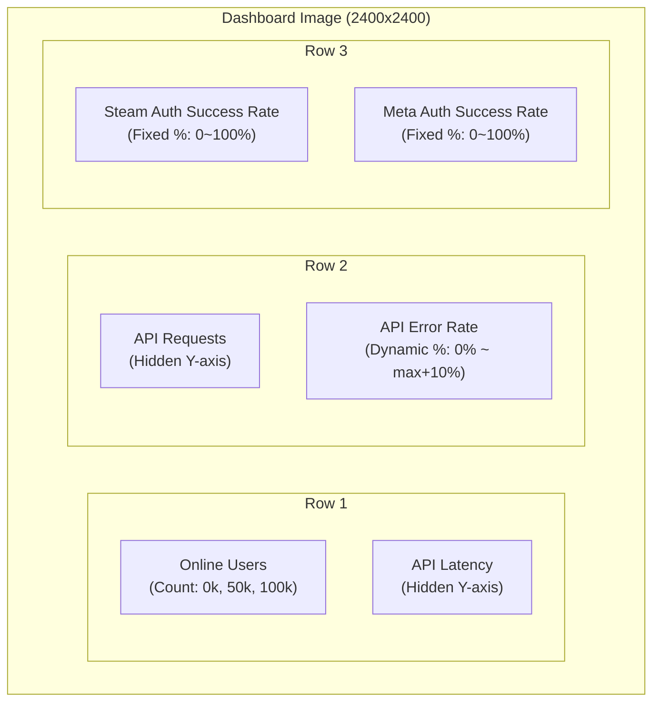

# Data Visualization Engine

This document defines the visualization system for **VRCPulse**. Charts are generated using [`plotters`](https://github.com/plotters-rs/plotters) and embedded in Discord messages as PNG images.

---

## Overview

The visualization engine transforms time-series data stored in SQLite into charts that can be sent via Discord embeds. All charts are rendered server-side as PNG images.

**Key Constraints:**
- Discord embed images: max 8MB (PNG typically 200-400KB)
- Dashboard size: 2400x2400 pixels (1:1 ratio for Discord embed)
- Dark theme to match Discord's UI

---

## Dashboard Preview

---

## Dashboard Layout

6 charts in a 3x2 grid:

---

## Chart Specifications

| Chart | Data Source | Y-Axis Format | Color |
|-------|-------------|---------------|-------|
| Online Users | `visits` | Count (0k, 50k, 100k) | `#6C6284` |
| API Latency | `api_latency` | Hidden | `#6C6284` |
| API Requests | `api_requests` | Hidden | `#6C6284` |
| API Error Rate | `api_errors` | Dynamic % (0% ~ max+10%) | `#ED4245` (Red) |
| Steam Auth Success Rate | `extauth_steam` | Fixed % (0~100%) | `#57F287` (Green) |
| Meta Auth Success Rate | `extauth_oculus` | Fixed % (0~100%) | `#57F287` (Green) |

---

## Data Processing

### Time Range & Resolution

| Setting | Value |
|---------|-------|
| Time Range | 12 hours |
| Downsample | 5-minute average |
| Data Points | ~144 points per metric |

### Value Transformation

Raw metric values from CloudFront are stored in `metric_logs` with their original units. The visualization layer transforms these values for display.

| Metric | Stored Unit | Transformation | Implementation |
|--------|-------------|----------------|----------------|
| `visits` | count | Downsample only | `load_metric_downsampled()` |
| `api_latency` | ms | Downsample only | `load_metric_downsampled()` |
| `api_requests` | count | Downsample only | `load_metric_downsampled()` |
| `api_errors` | count | Downsample + multiply by 100 | `load_metric_as_percent()` |
| `extauth_steam` | ms | Downsample + multiply by 100 | `load_metric_as_percent()` |
| `extauth_oculus` | ms | Downsample + multiply by 100 | `load_metric_as_percent()` |

**Query functions**: `src/visualization/query.rs:113-129`

> **Note**: The visualization layer treats `api_errors`, `extauth_steam`, and `extauth_oculus` as 0-1 ratio values and multiplies by 100 for percentage display. The actual format of CloudFront API responses is not validated by the collector.

---

## Color Palette

### Chart Colors

| Name | Hex | Usage |
|------|-----|-------|
| Background | `#0D1117` | Chart background |
| Primary Graph | `#6C6284` | Default metric line/area |
| Light Text | `#F2F3F5` | Titles |
| Muted Text | `#949BA4` | Axis labels, grid lines |

### Status Colors

| Name | Hex | Usage |
|------|-----|-------|
| Green | `#57F287` | Success rate charts |
| Red | `#ED4245` | Error rate chart |

---

## Command Integration

### `/status`

Generates the dashboard PNG and returns it as a Discord embed.

**Implementation**: `src/commands/status/dashboard.rs:21-148`

**Embed Fields:**
- System Status (emoji + description)
- Online Users (avg/max)
- API Error Rate (percentage)
- Steam Auth (percentage)
- Meta Auth (percentage)
- Component groups (API/Website, Realtime Networking)

**Status Indicators:**

| Indicator | Emoji | Embed Color |
|-----------|-------|-------------|
| `none` | 🟢 | `#57F287` (Green) |
| `minor` | 🟡 | `#FEE75C` (Yellow) |
| `major` | 🟠 | `#F0B132` (Orange) |
| `critical` | 🔴 | `#ED4245` (Red) |

**Component Status:**

| Status | Emoji |
|--------|-------|
| `operational` | 🟢 |
| `degraded_performance` | 🟡 |
| `partial_outage` | 🟠 |
| `major_outage` | 🔴 |
| `under_maintenance` | 🔵 |

See `docs/commands/status.md` for full command documentation.

---

## Source Files

| Component | File | Lines |
|-----------|------|-------|
| Module exports | `src/visualization/mod.rs` | 1-11 |
| Color constants | `src/visualization/theme.rs` | 1-34 |
| Data queries & downsampling | `src/visualization/query.rs` | 1-130 |
| Dashboard generation | `src/visualization/dashboard.rs` | 1-246 |
| Command handler | `src/commands/status/dashboard.rs` | 21-148 |
| Chart test example | `examples/chart_test.rs` | 1-359 |

---

## Implementation Checklist

- [x] Test chart generation (`examples/chart_test.rs`)
- [x] Create `src/visualization/` module
- [x] Implement theme constants (`theme.rs`)
- [x] Implement data query helpers (`query.rs`)
- [x] Implement dashboard generator (`dashboard.rs`)
- [x] Create `/status` command
- [ ] Add caching layer

---

## Caching Strategy

> **[NOT IMPLEMENTED]**: No caching is currently implemented. Dashboard is regenerated on each request.

**Planned approach:**
- Cache TTL: 2 minutes
- Cache key: `dashboard:{timestamp_bucket}`
- Bypass option for forced regeneration
