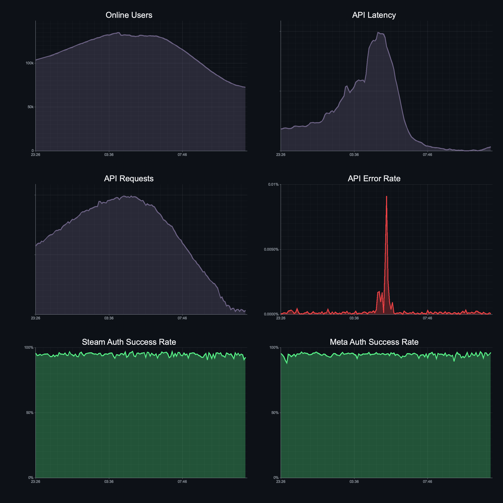
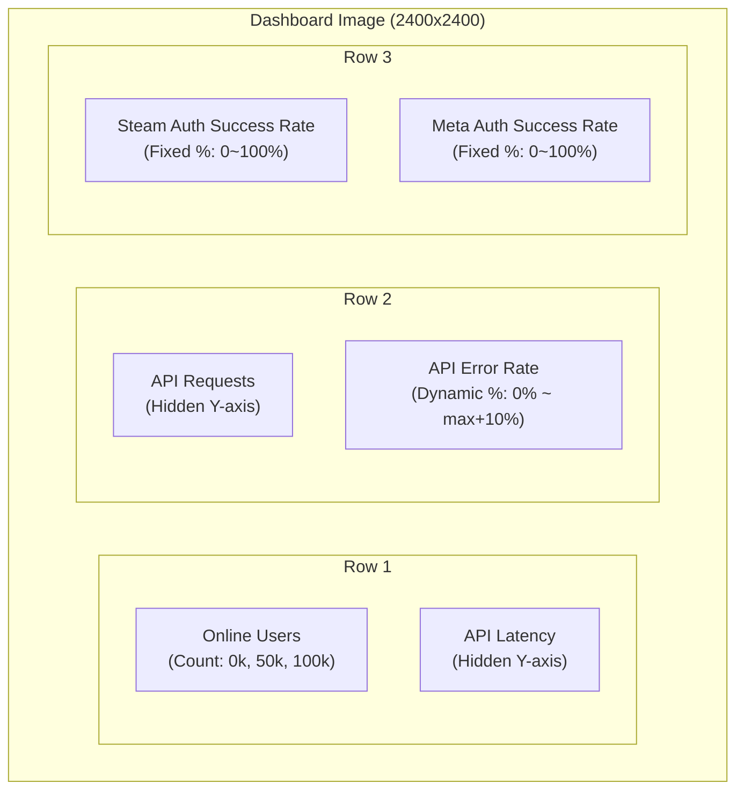

# Data Visualization Engine

This document defines the visualization system for **VRCPulse**. Charts are generated using [`plotters`](https://github.com/plotters-rs/plotters) and embedded in Discord messages as PNG images.

---

## Overview

The visualization engine transforms time-series data stored in SQLite into charts that can be sent via Discord embeds. All charts are rendered server-side as PNG images.

**Key Constraints:**
- Discord embed images: max 8MB (PNG typically 200-400KB)
- Dashboard size: 2400x2400 pixels (1:1 ratio for Discord embed)
- Dark theme to match Discord's UI

---

## Dashboard Preview



---

## Dashboard Layout

6 charts in a 3x2 grid:



---

## Chart Specifications

| Chart | Data Source | Y-Axis Format | Color |
|-------|-------------|---------------|-------|
| Online Users | `visits` | Count (0k, 50k, 100k) | `#6C6284` |
| API Latency | `api_latency` | Hidden | `#6C6284` |
| API Requests | `api_requests` | Hidden | `#6C6284` |
| API Error Rate | `api_errors` | Dynamic % (0% ~ max+10%) | `#ED4245` (Red) |
| Steam Auth Success Rate | `extauth_steam` | Fixed % (0~100%) | `#57F287` (Green) |
| Meta Auth Success Rate | `extauth_oculus` | Fixed % (0~100%) | `#57F287` (Green) |

---

## Data Processing

### Time Range & Resolution

| Setting | Value |
|---------|-------|
| Time Range | 12 hours |
| Downsample | 5-minute average |
| Data Points | ~144 points per metric |

### Value Transformation

| Metric | Transformation |
|--------|----------------|
| `visits` | Raw count |
| `api_latency` | Raw (normalized 0-1) |
| `api_requests` | Raw (normalized 0-1) |
| `api_errors` | Multiply by 100 (to %) |
| `extauth_steam` | Multiply by 100 (to %) |
| `extauth_oculus` | Multiply by 100 (to %) |

---

## Color Palette

### Chart Colors

| Name | Hex | Usage |
|------|-----|-------|
| Background | `#0D1117` | Chart background |
| Primary Graph | `#6C6284` | Default metric line/area |
| Light Text | `#F2F3F5` | Titles |
| Muted Text | `#949BA4` | Axis labels, grid lines |

### Status Colors

| Name | Hex | Usage |
|------|-----|-------|
| Green | `#57F287` | Success rate charts |
| Red | `#ED4245` | Error rate chart |

---

## Command Integration

### `/status dashboard`

Generates the dashboard PNG and returns it as a Discord embed.

**Response Embed:**

```rust
CreateEmbed::default()
    .title("VRChat Status Dashboard")
    .color(Colour::new(embed_color)) // Green/Yellow/Orange/Red based on status
    .image("attachment://dashboard.png")
    .field("System Status", "🟢 All Systems Operational", false)
    .field("Online Users", "113k (avg) / 135k (max)", true)
    .field("API Error Rate", "0.0003%", true)
    .field("\u{200B}", "\u{200B}", true)
    .field("Steam Auth", "94.7%", true)
    .field("Meta Auth", "94.6%", true)
    .field("\u{200B}", "\u{200B}", true)
    .field("Components", component_status, false) // 🟢 API / Website\n🟢 Authentication...
    .footer(CreateEmbedFooter::new("Last 12 hours"))
    .timestamp(Timestamp::now())
```

**Status Indicators:**

| Indicator | Emoji | Embed Color |
|-----------|-------|-------------|
| `none` | 🟢 | `#57F287` (Green) |
| `minor` | 🟡 | `#FEE75C` (Yellow) |
| `major` | 🟠 | `#F0B132` (Orange) |
| `critical` | 🔴 | `#ED4245` (Red) |

**Component Status:**

| Status | Emoji |
|--------|-------|
| `operational` | 🟢 |
| `degraded_performance` | 🟡 |
| `partial_outage` | 🟠 |
| `major_outage` | 🔴 |
| `under_maintenance` | 🔵 |

**Attachment:**
```rust
CreateAttachment::bytes(png_bytes, "dashboard.png")
```

---

## Module Structure

```
src/visualization/
├── mod.rs           # Module exports
├── theme.rs         # Color constants
├── query.rs         # Data loading & downsampling
└── dashboard.rs     # Dashboard generation
```

---

## Implementation Checklist

- [x] Test chart generation (`examples/chart_test.rs`)
- [x] Create `src/visualization/` module
- [x] Implement theme constants (`theme.rs`)
- [x] Implement data query helpers (`query.rs`)
- [x] Implement dashboard generator (`dashboard.rs`)
- [x] Create `/status` command
- [ ] Add caching layer

---

## Caching Strategy

| Chart Type | Cache TTL | Rationale |
|------------|-----------|-----------|
| Dashboard | 2 minutes | Balances freshness with load |

**Cache Bypass:**
- `fresh: true` option forces regeneration
- Cache key: `dashboard:{timestamp_bucket}`
